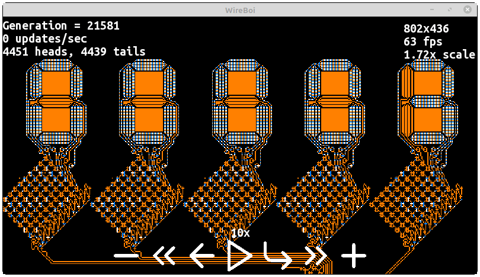
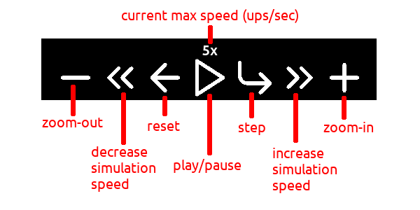

Wireboi is an implementation of the [wireworld](https://en.wikipedia.org/wiki/) cellular automaton. It is written in C++ and uses SFML for graphics.

# Getting started
Let's simulate a wireworld computer that calculates prime numbers,

+ Download latest executable for your OS (Windows/Linux) from the releases page and download [primes.png](Examples/primes.png)
+ Run the executable, an open-file dialog will appear, browse and select primes.png 

[More info on how the computer works](https://www.quinapalus.com/wi-index.html)

# Creating your own circuits
You can create your circuits using any image editor ([GIMP](https://www.gimp.org/)) and export as `.png` file. Every pixel is one cell. See the `examples` folder.

### Rules
A Wireworld cell can be in one of four different states,

+ empty (RGB: 0, 0, 0)
+ electron head (RGB: 0, 128, 255)
+ electron tail (RGB: 255, 255, 255)
+ conductor (RGB: 255, 128, 0)

As in all cellular automata, time proceeds in discrete steps called generations (sometimes "gens" or "ticks"). Cells behave as follows:

+ empty → empty
+ electron head → electron tail
+ electron tail → conductor
+ conductor → electron head if exactly one or two of the neighbouring cells electron heads, otherwise remains conductor.

Wireworld uses what is called the Moore neighborhood, which means that in the rules above, neighbouring means one cell away (range value of one) in any direction, both orthogonal and diagonal. 

# User interface

### Dock


### Keyboard
| Action  | Key    |
|---------|--------|
| Pan | <kbd>↑</kbd> <kbd>←</kbd> <kbd>↓</kbd> <kbd>→</kbd> or <kbd>W</kbd> <kbd>A</kbd> <kbd>S</kbd> <kbd>D</kbd> |
| Zoom in | <kbd>=</kbd> |
| Zoom out | <kbd>-</kbd> |
| Play/Pause | <kbd>Space</kbd> or <kbd>F6</kbd> |
| Step | <kbd>F10</kbd> |
| Decrease speed | <kbd>,</kbd> |
| Increase speed | <kbd>.</kbd> |
| Toggle UI overlay | <kbd>G</kbd> |

### Mouse
Hold right mouse button and move to pan and scroll up/down to zoom in/out.

# Installing from source
+ Clone the repo using `git clone`
```
git clone https://github.com/RainingComputers/Wireboi.git
cd Wireboi
```
+ Build and install
```
sudo apt-get install libsfml-dev libgtk-3-dev
make build 
sudo make install
```